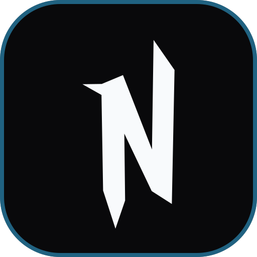

<div align="center">



# NETHERITE

**The Sovereign Markdown Studio, TikZ Vector Engine, and Visual Architecture Workspace.**  
*Backed 100% by your personal Google Drive with open standard formats (`.md`, `.tikz`, `.mmd`, `.apollon`, `.excalidraw`). Zero proprietary cloud databases. Zero vendor lock-in.*

[](https://nextjs.org/)
[](https://www.typescriptlang.org/)
[](https://tailwindcss.com/)
[](https://ctan.org/pkg/pgf)
[](https://katex.org/)
[](https://mermaid.js.org/)
[](https://github.com/ls1intum/Apollon)
[](https://excalidraw.com/)
[](https://ai.google.dev/)
[](https://developers.google.com/drive)

[Explore Features](https://craftnetherite.vercel.app/features) • [Launch Studio](https://craftnetherite.vercel.app/editor) • [Privacy Policy](https://craftnetherite.vercel.app/privacy) • [Terms](https://craftnetherite.vercel.app/terms)

</div>

---

## 💎 What is Netherite?

Netherite is an artisanal, distraction-free workspace designed for researchers, software engineers, mathematicians, and students. Instead of locking your notes and whiteboards inside proprietary silos, Netherite synchronizes directly with your personal **Google Drive**, saving everything in transparent, open standard formats.

Whether you are authoring dense mathematical proofs in **KaTeX**, drafting standalone vector state machines in **TikZ LaTeX**, visualizing microservices in **Mermaid**, modeling enterprise domain architectures in **Apollon UML**, or brainstorming on an infinite **Excalidraw** canvas, Netherite provides a unified sovereign environment.

---

## 🌟 Key Capabilities

```
┌─────────────────────────────────────────────────────────────────────────────┐
│                              NETHERITE STUDIO                               │
├───────────────────┬───────────────────┬───────────────────┬─────────────────┤
│   PROSE & MATH    │   VECTOR TIKZ     │   ARCHITECTURE    │   WHITEBOARD    │
│  Markdown + KaTeX │  TeXLive + WASM   │ Mermaid + Apollon │   Excalidraw    │
├───────────────────┼───────────────────┼───────────────────┼─────────────────┤
│   DIFF INSPECTOR  │  GOOGLE CALENDAR  │  GEMINI COPILOT   │  SOVEREIGN SYNC │
│ Git-Style Compare │ 1-Click Meetings  │ Context-Aware AI  │ Zero-DB G-Drive │
└───────────────────┴───────────────────┴───────────────────┴─────────────────┘
```

### 1. Sovereign Google Drive Storage (Zero Database)
- **100% Private & Direct**: Every document, diagram, and whiteboard resides inside your personal Google Drive under the `/Netherite` directory.
- **Open Standards**: Notes are saved as `.md`, TikZ graphics as `.tikz` / `.tex`, Mermaid flows as `.mmd`, UML models as `.apollon`, and sketches as `.excalidraw`.
- **Zero Proprietary Lock-In**: If Netherite disappeared, your files remain completely intact, portable, and readable in Obsidian, VS Code, Overleaf, or any local editor.

### 2. TikZ LaTeX Vector Graphics Studio (`.tikz` / `.tex`)
- **Dual-Engine Compilation**: Lightning-fast TeXLive cloud engine paired with a sandboxed client-side WebAssembly fallback engine.
- **Full Standalone Document Support**: Supports `\documentclass{standalone}`, custom packages (`amsmath`, `tikz-3dplot`, `cmbright`, `pgfplots`), custom macros (`\pgfmathdeclarefunction`), and rich styling libraries (`arrows.meta`, `positioning`, `calc`, `patterns`, `decorations.pathmorphing`).
- **Interactive Vector Engine**: Smooth zoom and pan up to 500% with zero pixelation, adaptive dark/light preview toggle, 1-click SVG copy, and vector file export.

### 3. Dual-Pane Markdown & KaTeX Scientific Prose (`.md`)
- **Real-Time Mathematical Typesetting**: Full support for inline math (`$...$`) and display block equations (`$$...$$`) rendered with ultra-fast KaTeX.
- **Floating Formatting Bar**: Multi-color highlight markers (purple, green, yellow, pink, blue), heading styles, code blocks with syntax highlighting for 100+ languages, and checklists.
- **Live Document Stats & Outline**: Real-time word count, character count, and interactive Table of Contents outline sidebar for instant navigation.

### 4. Interactive Mermaid Architecture Studio (`.mmd`)
- **Real-Time Diagram Preview**: Type Mermaid syntax and inspect live high-contrast SVG renderings.
- **Interactive Canvas Controls**: Drag to pan, mouse wheel zoom (20%–500%), and 1-click zoom reset.
- **Comprehensive Diagram Types**: Flowcharts (TD/LR), Sequence Diagrams, State Diagrams, Entity Relationship (ER), Git Graphs, Class Diagrams, Gantt Roadmaps, and Mindmaps.

### 5. Apollon Visual UML Modeling Engine (`.apollon`)
- **13 Standard Diagram Suites**:
  - *Structural*: Class Diagrams, Object Diagrams, Component Diagrams, Deployment Diagrams.
  - *Behavioral & Workflow*: Activity Diagrams, Use Case Diagrams, Communication Diagrams, Flowcharts, BPMN 2.0 Business Processes.
  - *Formal Systems*: Petri Nets, Reachability Graphs, Sequential Function Charts (SFC), Syntax Trees.
- **Visual Property Inspector**: Drag and drop classes, interfaces, enumerations, and abstract classes. Add and reorder attributes, methods, and visibility modifiers dynamically.

### 6. Excalidraw Infinite Whiteboard (`.excalidraw`)
- **Native Canvas Embedding**: Integrated Excalidraw vector canvas with shapes, arrows, freehand drawing, and eraser tools.
- **Hand-Drawn Aesthetics**: Curated architectural sketch typography (Excalifont and Crafty Girls) with dark and light canvas styling.

### 7. Git-Style Diff Inspector & Version Control
- **In-Browser Delta Engine**: Real-time comparison of local drafts against your Google Drive cloud baseline.
- **Side-by-Side & Unified Diffs**: Color-coded addition (`+N`) and deletion (`-N`) counters, folded unchanged lines, and 1-click revert or commit.

### 8. Gemini AI Copilot & Diagram Assistant
- **Context-Aware Sidebar**: Interacts directly with your current document, math proof, or diagram code.
- **1-Click Generation & Patching**: Generate TikZ diagrams, Mermaid flows, UML architectures, or KaTeX explanations and insert them directly into your workspace.

### 9. Google Calendar Studio & Meeting Notes
- **Integrated Schedule Hub**: Monthly and agenda calendar views inside the workspace tab bar.
- **1-Click Meeting Notes**: Create events with Google Meet / Zoom links and immediately generate linked markdown notes.

### 10. Model Context Protocol (MCP) Server
- Allows autonomous AI coding agents (Claude Desktop, Cursor, Antigravity, Windsurf) to search, read, create, and manage your Google Drive notes and diagrams.

---

## 📊 Feature Comparison

| Feature | Netherite | Notion | Obsidian | Overleaf |
| :--- | :---: | :---: | :---: | :---: |
| **Zero-Knowledge Sovereign Storage** | ✅ **Google Drive** | ❌ Proprietary Cloud | ⚠️ Local Only | ❌ Proprietary Cloud |
| **TikZ LaTeX Standalone Vector Studio** | ✅ **Dual-Engine** | ❌ No | ❌ Plugin Required | ✅ Yes (Full TeX) |
| **Native KaTeX Math (Inline & Block)** | ✅ **Instant** | ⚠️ Basic | ✅ Yes | ✅ Full TeX |
| **Apollon UML Modeling (13 Suites)** | ✅ **Native** | ❌ No | ❌ No | ❌ No |
| **Interactive Mermaid with Zoom/Pan** | ✅ **Native (500%)**| ⚠️ Static | ⚠️ Static | ❌ No |
| **Excalidraw Infinite Whiteboard** | ✅ **Native (.excalidraw)** | ❌ No | ⚠️ Plugin | ❌ No |
| **Git-Style Line Diff Inspector** | ✅ **In-Browser** | ⚠️ Paid History | ⚠️ Git Plugin | ⚠️ Paid History |
| **Google Calendar Studio & Sync** | ✅ **Native** | ⚠️ Integration | ⚠️ Community | ❌ No |
| **Model Context Protocol (MCP) Server** | ✅ **Built-in** | ❌ No | ❌ No | ❌ No |

---

## 🚀 Quick Start

### Prerequisites
- [Bun](https://bun.sh/) (or Node.js 18+)
- A [Google Cloud Console Project](https://console.cloud.google.com/) with **Google Drive API** and **Google Calendar API** enabled.

### 1. Clone & Install Dependencies
```bash
git clone https://github.com/parv141206/netherite.git
cd netherite
bun install
```

### 2. Configure Environment Variables
Copy `.env.example` to `.env`:
```bash
cp .env.example .env
```

Set your OAuth keys and secrets in `.env`:
```env
AUTH_SECRET="<generate-using-openssl-rand-base64-32>"
AUTH_TRUST_HOST="true"
AUTH_GOOGLE_ID="your-client-id.apps.googleusercontent.com"
AUTH_GOOGLE_SECRET="your-client-secret"
```

### 3. Run Development Server
```bash
bun run dev
```
Open [http://localhost:3000](http://localhost:3000) in your browser.

---

## 🤖 Model Context Protocol (MCP) Setup

Netherite includes an official MCP Server (`@modelcontextprotocol/sdk`) allowing AI assistants like **Claude Desktop**, **Cursor**, and **Antigravity** to manage your notes and diagrams autonomously.

Add this configuration to your `claude_desktop_config.json`:

```json
{
  "mcpServers": {
    "netherite": {
      "command": "bun",
      "args": ["run", "<path-to-netherite>/src/mcp/cli.ts"]
    }
  }
}
```

### Available MCP Tools:
1. `netherite_list_files` — List documents and folders with filters (`markdown`, `uml`, `mermaid`, `drawing`, `tikz`, `folder`).
2. `netherite_search_notes` — Search notes and diagrams by query.
3. `netherite_read_note` — Read raw content and metadata of any file.
4. `netherite_create_markdown` — Create markdown notes with KaTeX math and formatting.
5. `netherite_create_mermaid` — Generate system flows and sequence diagrams.
6. `netherite_create_uml` — Generate Apollon UML architectures across 13 types.
7. `netherite_create_drawing` — Create Excalidraw whiteboards and sketches.
8. `netherite_update_note` — Modify or append content to existing documents.
9. `netherite_manage_folders` — Organize folders and directories.
10. `netherite_delete_file` — Move files safely to Google Drive trash.

---

## ⌨️ Keyboard Shortcuts

| Shortcut | Action |
| :--- | :--- |
| <kbd>Ctrl</kbd> + <kbd>S</kbd> / <kbd>Cmd</kbd> + <kbd>S</kbd> | Save document to Google Drive |
| <kbd>Ctrl</kbd> + <kbd>K</kbd> / <kbd>Cmd</kbd> + <kbd>K</kbd> | Open Global Workspace Search |
| <kbd>Ctrl</kbd> + <kbd>N</kbd> / <kbd>Cmd</kbd> + <kbd>N</kbd> | Create new markdown note |
| <kbd>/</kbd> | Open block formatting slash menu |
| <kbd>Tab</kbd> | Indent 4 spaces inside code blocks |
| <kbd>Ctrl</kbd> + <kbd>Wheel</kbd> / Pinch | Dynamic typography zoom (11px–32px) |

---

## 📂 Project Architecture

```
netherite/
├── public/               # Favicons, vector logos, screenshots, and fonts
│   ├── favicon.svg       # Adaptive high-contrast squircle favicon
│   ├── images/           # 1896x980 native landscape feature screenshots
│   └── Excalifont.woff2  # Hand-drawn sketch typography
├── src/
│   ├── app/              # Next.js 15 App Router (/editor, /features, /terms, /privacy)
│   ├── apollon/          # Apollon UML Modeling Engine (13 diagram specifications)
│   ├── components/
│   │   ├── canvas/       # DrawingCanvas, UmlCanvas, MermaidCanvas, TikzCanvas
│   │   ├── editor/       # TipTap core, KaTeX extensions, syntax highlighting
│   │   ├── copilot/      # Gemini AI Copilot interactive assistant
│   │   ├── calendar/     # Google Calendar studio & meeting notes
│   │   ├── features/     # Full-resolution landscape features showcase
│   │   ├── landing/      # Sovereign landing page & marketing hero
│   │   └── workspace/    # Sidebar, DiffModal, Tabs, Settings, HeaderBar
│   ├── hooks/            # Capacitor back-button, theme hooks
│   ├── mcp/              # Native Model Context Protocol (MCP) server
│   └── server/           # Google Drive API, Google Calendar API, NextAuth v5, tRPC
```

---

## 📜 License & Acknowledgments

Distributed under the **MIT License**. Crafted with care for thinkers, researchers, engineers, and mathematicians.
